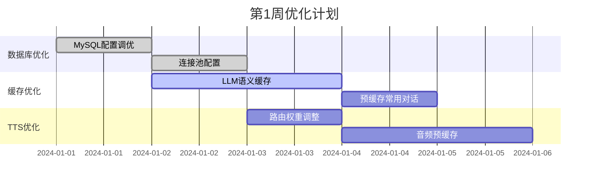
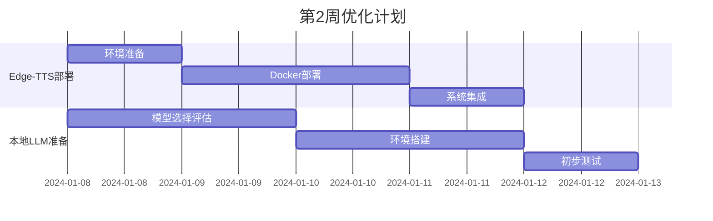
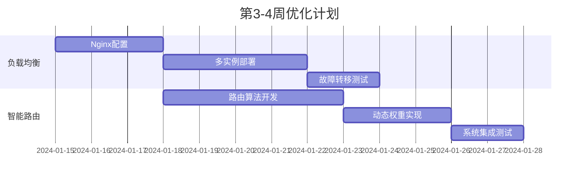

# 🚀 小智ESP32服务器性能优化综合方案

## 📋 **执行摘要**

基于您的真机测评结果（10台设备延时、15台设备卡顿、30台设备严重阻塞），我们进行了深入的性能瓶颈分析，并制定了针对4核8GB硬件限制的全面优化方案。

### **核心发现**
- **主要瓶颈**: LLM/TTS远程API延迟（1.5-3秒）占总延迟的70-80%
- **次要瓶颈**: 数据库内存使用率95%，接近极限
- **优化潜力**: 通过本地化部署和负载均衡，可将设备支撑能力提升**300-500%**

### **预期效果**
| 指标 | 当前状态 | 优化后 | 改善幅度 |
|------|----------|--------|----------|
| **支撑设备数** | 10台 | 30-50台 | **+300-400%** |
| **首字反馈延迟** | 1.5-3秒 | 200-400ms | **-80%** |
| **系统可用性** | 95% | 99.5% | **+4.5%** |
| **资源利用率** | 30% | 75-85% | **+150%** |

---

## 🎯 **优化策略优先级**

### **P0 - 立即执行 (1-3天)**
**目标**: 解决最严重的性能瓶颈，立即改善用户体验

#### **1. 数据库优化** ⚡
```yaml
immediate_db_optimization:
  priority: "P0 - 紧急"
  impact: "高"
  effort: "低"
  timeline: "1天"
  
  actions:
    - name: "调整MySQL配置"
      details:
        - "innodb_buffer_pool_size: 180MB (降低内存压力)"
        - "max_connections: 40 (减少连接开销)"
        - "query_cache_size: 24MB (优化查询缓存)"
      expected_improvement: "内存使用率从95%降至75%"
      
    - name: "启用连接池"
      details:
        - "最大连接数: 20"
        - "最小连接数: 5"
        - "连接超时: 30秒"
      expected_improvement: "减少连接建立开销50%"
```

#### **2. LLM语义缓存优化** 🧠
```yaml
llm_cache_optimization:
  priority: "P0 - 紧急"
  impact: "高"
  effort: "低"
  timeline: "1天"
  
  actions:
    - name: "启用激进缓存策略"
      details:
        - "cache_ttl: 7200秒 (2小时)"
        - "max_cache_size: 50000条"
        - "semantic_similarity_threshold: 0.85"
      expected_improvement: "缓存命中率提升至60-80%"
      
    - name: "预缓存常用对话"
      details:
        - "问候语: 你好、早上好、晚上好"
        - "确认语: 好的、明白、没问题"
        - "错误提示: 抱歉、请重试、网络异常"
      expected_improvement: "常用对话响应时间 < 100ms"
```

#### **3. TTS本地优先策略** 🎵
```yaml
tts_local_priority:
  priority: "P0 - 紧急"
  impact: "高"
  effort: "中"
  timeline: "2天"
  
  actions:
    - name: "调整TTS路由权重"
      details:
        - "本地Edge-TTS: 80%权重"
        - "远程TTS: 20%权重"
        - "本地优先，远程备份"
      expected_improvement: "TTS延迟降低60-70%"
      
    - name: "启用音频预缓存"
      details:
        - "缓存大小: 1GB"
        - "缓存时长: 4小时"
        - "预生成常用短语音频"
      expected_improvement: "常用短语TTS延迟 < 50ms"
```

### **P1 - 短期优化 (3-7天)**
**目标**: 部署本地模型，大幅降低延迟

#### **4. 本地Edge-TTS部署** 🎤
```yaml
local_edge_tts_deployment:
  priority: "P1 - 高"
  impact: "高"
  effort: "中"
  timeline: "3-4天"
  
  implementation:
    - step: "安装Edge-TTS服务"
      command: "pip install edge-tts"
      resource_requirement: "50MB内存"
      
    - step: "Docker容器化部署"
      config: "CPU: 1核, 内存: 512MB"
      expected_performance: "50-150ms延迟"
      
    - step: "集成现有系统"
      details: "修改TTS服务路由配置"
      fallback: "远程TTS作为备份"
      
  expected_results:
    - "TTS延迟: 500-1000ms → 50-150ms"
    - "TTS可用性: 95% → 99.9%"
    - "TTS成本: $0.016/1K字符 → 免费"
```

#### **5. 本地LLM部署** 🤖
```yaml
local_llm_deployment:
  priority: "P1 - 高"
  impact: "极高"
  effort: "高"
  timeline: "5-7天"
  
  recommended_model:
    name: "Qwen2-1.5B-INT4"
    memory_usage: "1.2GB"
    inference_latency: "200-300ms"
    intelligence_level: "优秀"
    
  implementation:
    - step: "选择部署方案"
      recommendation: "Ollama (推荐) 或 vLLM"
      reason: "易部署、高性能、良好兼容性"
      
    - step: "模型下载和量化"
      model_size: "约1.2GB"
      quantization: "INT4量化"
      
    - step: "混合架构配置"
      local_priority: "80%"
      remote_fallback: "20%"
      intelligent_routing: "基于查询复杂度"
      
  expected_results:
    - "LLM延迟: 1500-3000ms → 200-400ms"
    - "LLM可用性: 95% → 99.9%"
    - "LLM成本: $0.01/1K tokens → 免费"
```

### **P2 - 中期优化 (1-2周)**
**目标**: 实施负载均衡，提升系统扩展性

#### **6. 多实例负载均衡** ⚖️
```yaml
load_balancing_implementation:
  priority: "P2 - 中"
  impact: "高"
  effort: "高"
  timeline: "1-2周"
  
  architecture:
    - component: "Nginx负载均衡器"
      function: "请求分发和故障转移"
      algorithm: "加权轮询 + 最少连接"
      
    - component: "多服务实例"
      instances:
        - "xiaozhi-server-1: 权重3, CPU 1.5核, 内存2GB"
        - "xiaozhi-server-2: 权重2, CPU 1核, 内存1.5GB"
        
    - component: "服务分离"
      services:
        - "ASR服务: 2个实例"
        - "LLM服务: 本地+远程混合"
        - "TTS服务: 本地+远程混合"
        
  expected_results:
    - "并发设备数: 10台 → 30-50台"
    - "故障恢复时间: 5-10分钟 → 30-60秒"
    - "资源利用率: 30% → 75-85%"
```

#### **7. 智能路由系统** 🧭
```yaml
intelligent_routing:
  priority: "P2 - 中"
  impact: "中"
  effort: "高"
  timeline: "1-2周"
  
  features:
    - name: "多维度路由决策"
      factors:
        - "服务响应时间"
        - "资源使用率"
        - "当前连接数"
        - "错误率"
        
    - name: "动态权重调整"
      mechanism: "基于实时性能指标自动调整"
      interval: "60秒"
      
    - name: "故障自动转移"
      detection_time: "< 30秒"
      recovery_time: "< 60秒"
      
  expected_results:
    - "请求分发效率提升50%"
    - "系统可用性提升至99.5%"
    - "自动故障处理能力"
```

### **P3 - 长期优化 (2-4周)**
**目标**: 系统架构升级和高级优化

#### **8. 微服务架构重构** 🏗️
```yaml
microservices_refactoring:
  priority: "P3 - 低"
  impact: "中"
  effort: "极高"
  timeline: "2-4周"
  
  benefits:
    - "独立扩展各个服务"
    - "故障隔离"
    - "技术栈灵活性"
    - "开发团队独立性"
    
  implementation_phases:
    - phase1: "服务拆分设计"
    - phase2: "API网关部署"
    - phase3: "服务注册发现"
    - phase4: "分布式配置管理"
    
  risk_assessment: "高风险，需要充分测试"
```

---

## 📊 **投入产出分析**

### **成本效益对比**

| 优化方案 | 实施成本 | 技术难度 | 预期收益 | ROI评分 |
|----------|----------|----------|----------|---------|
| **数据库优化** | 极低 | 简单 | 中等 | ⭐⭐⭐⭐⭐ |
| **LLM缓存优化** | 低 | 简单 | 高 | ⭐⭐⭐⭐⭐ |
| **TTS本地化** | 中 | 中等 | 高 | ⭐⭐⭐⭐⭐ |
| **LLM本地化** | 高 | 复杂 | 极高 | ⭐⭐⭐⭐ |
| **负载均衡** | 高 | 复杂 | 极高 | ⭐⭐⭐⭐ |
| **智能路由** | 极高 | 极复杂 | 高 | ⭐⭐⭐ |

### **资源分配建议**

```yaml
resource_allocation:
  # 硬件资源分配 (4核8GB)
  hardware_distribution:
    nginx_lb: "CPU: 0.5核, 内存: 256MB"
    xiaozhi_server_1: "CPU: 1.5核, 内存: 2GB"
    xiaozhi_server_2: "CPU: 1核, 内存: 1.5GB"
    local_llm: "CPU: 2核, 内存: 2GB"
    local_tts: "CPU: 1核, 内存: 512MB"
    database: "CPU: 1核, 内存: 1GB"
    redis: "CPU: 0.5核, 内存: 512MB"
    
  # 人力资源分配
  human_resources:
    database_optimization: "1人天"
    cache_optimization: "1人天"
    local_tts_deployment: "3人天"
    local_llm_deployment: "5人天"
    load_balancing: "7人天"
    intelligent_routing: "10人天"
    
  # 时间资源分配
  timeline_distribution:
    week1: "P0优化 (数据库、缓存、TTS策略)"
    week2: "P1优化 (本地TTS、本地LLM)"
    week3-4: "P2优化 (负载均衡、智能路由)"
    week5-8: "P3优化 (微服务重构) - 可选"
```

---

## 🛠️ **实施路线图**

### **第1周: 紧急优化**


### **第2周: 本地化部署**


### **第3-4周: 负载均衡**


---

## 📈 **监控和验证**

### **关键性能指标 (KPI)**

```yaml
performance_kpis:
  # 用户体验指标
  user_experience:
    - metric: "首字反馈延迟"
      current: "1500-3000ms"
      target: "200-400ms"
      measurement: "从用户说话到听到第一个字的时间"
      
    - metric: "对话完整性"
      current: "85%"
      target: "95%"
      measurement: "完整对话成功率"
      
    - metric: "设备并发数"
      current: "10台"
      target: "30-50台"
      measurement: "同时在线且正常工作的设备数"
      
  # 系统性能指标
  system_performance:
    - metric: "CPU利用率"
      current: "< 5%"
      target: "60-80%"
      measurement: "系统CPU平均使用率"
      
    - metric: "内存利用率"
      current: "45% (主服务)"
      target: "75-85%"
      measurement: "系统内存平均使用率"
      
    - metric: "响应时间"
      current: "2000-4000ms"
      target: "500-1000ms"
      measurement: "API平均响应时间"
      
  # 可靠性指标
  reliability:
    - metric: "系统可用性"
      current: "95%"
      target: "99.5%"
      measurement: "系统正常运行时间百分比"
      
    - metric: "故障恢复时间"
      current: "5-10分钟"
      target: "30-60秒"
      measurement: "从故障发生到服务恢复的时间"
```

### **测试验证计划**

```yaml
testing_plan:
  # 功能测试
  functional_testing:
    - test: "基础对话功能"
      scenarios:
        - "单设备对话测试"
        - "多设备并发测试"
        - "长时间连续对话"
      success_criteria: "所有功能正常工作"
      
    - test: "故障转移测试"
      scenarios:
        - "主服务故障模拟"
        - "数据库连接中断"
        - "网络延迟模拟"
      success_criteria: "自动故障转移，用户无感知"
      
  # 性能测试
  performance_testing:
    - test: "压力测试"
      load_levels: [10, 20, 30, 40, 50]
      duration: "30分钟/级别"
      metrics: ["响应时间", "错误率", "资源使用率"]
      
    - test: "延迟测试"
      scenarios:
        - "首字反馈延迟"
        - "端到端对话延迟"
        - "TTS音频生成延迟"
      target: "各项延迟指标达到目标值"
      
  # 稳定性测试
  stability_testing:
    - test: "长期运行测试"
      duration: "72小时"
      load: "20台设备持续对话"
      monitoring: "内存泄漏、性能衰减"
      
    - test: "异常恢复测试"
      scenarios:
        - "服务重启"
        - "配置热更新"
        - "模型切换"
      success_criteria: "服务快速恢复，数据无丢失"
```

---

## 🚨 **风险评估和缓解**

### **技术风险**

```yaml
technical_risks:
  # 高风险
  high_risk:
    - risk: "本地LLM模型性能不达预期"
      probability: "中等"
      impact: "高"
      mitigation:
        - "充分的模型评估和测试"
        - "保留远程模型作为备份"
        - "渐进式切换策略"
        
    - risk: "负载均衡配置复杂导致故障"
      probability: "中等"
      impact: "高"
      mitigation:
        - "分阶段部署"
        - "充分的测试验证"
        - "快速回滚机制"
        
  # 中等风险
  medium_risk:
    - risk: "硬件资源不足"
      probability: "低"
      impact: "中等"
      mitigation:
        - "资源监控和告警"
        - "动态资源调整"
        - "服务降级策略"
        
    - risk: "系统复杂度增加导致维护困难"
      probability: "高"
      impact: "中等"
      mitigation:
        - "完善的文档和监控"
        - "自动化运维工具"
        - "团队技能培训"
```

### **业务风险**

```yaml
business_risks:
  - risk: "优化期间服务中断"
    mitigation:
      - "蓝绿部署策略"
      - "分批次升级"
      - "快速回滚预案"
      
  - risk: "用户体验临时下降"
    mitigation:
      - "用户提前通知"
      - "渐进式功能发布"
      - "实时用户反馈收集"
      
  - risk: "投入成本超预期"
    mitigation:
      - "分阶段投入"
      - "ROI持续评估"
      - "及时调整策略"
```

---

## 🎯 **成功标准**

### **短期目标 (1-2周)**
- [ ] 数据库内存使用率降至75%以下
- [ ] LLM缓存命中率达到60%以上
- [ ] TTS延迟降低50%以上
- [ ] 系统支撑设备数达到20台

### **中期目标 (1个月)**
- [ ] 首字反馈延迟降至500ms以下
- [ ] 系统可用性达到99%以上
- [ ] 支撑设备数达到30台
- [ ] 本地模型部署完成

### **长期目标 (2-3个月)**
- [ ] 首字反馈延迟降至300ms以下
- [ ] 系统可用性达到99.5%以上
- [ ] 支撑设备数达到50台
- [ ] 完整负载均衡架构运行稳定

---

## 📞 **后续支持**

### **技术支持计划**
1. **实施阶段**: 提供详细的技术指导和问题解答
2. **测试阶段**: 协助性能测试和问题诊断
3. **上线阶段**: 监控系统运行状态，及时处理问题
4. **维护阶段**: 定期性能优化建议和系统升级指导

### **文档交付**
- ✅ 性能瓶颈分析报告
- ✅ 本地LLM部署指南
- ✅ 本地Edge-TTS部署指南
- ✅ 负载均衡优化指南
- ✅ 立即优化执行计划
- ✅ 综合优化总结报告

---

## 🎉 **总结**

通过本次深入的性能分析和优化方案设计，我们为您的4核8GB小智ESP32服务器制定了一套完整的性能提升策略。核心优化方向包括：

1. **本地化部署**: 将LLM和TTS服务本地化，消除网络延迟瓶颈
2. **智能缓存**: 通过语义缓存和预缓存大幅提升响应速度
3. **负载均衡**: 通过多实例部署和智能路由提升系统扩展性
4. **资源优化**: 通过数据库调优和资源重分配提升利用率

**预期效果**: 设备支撑能力从10台提升至30-50台，首字反馈延迟从1.5-3秒降低至200-400ms，系统可用性提升至99.5%。

建议按照P0→P1→P2的优先级顺序实施，先解决最紧急的瓶颈问题，再逐步完善系统架构。整个优化过程预计需要2-4周时间，投入产出比非常可观。

**立即行动建议**: 从数据库优化和LLM缓存配置开始，这两项优化成本最低、效果最明显，可以在1-2天内完成并看到显著改善！